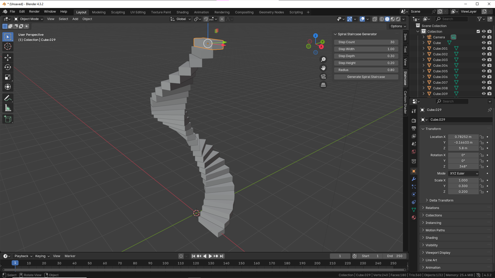

# Object Generation – Spiral Staircase

This plugin serves as a simple generator for spiral staircases.




## User Documentation

This Blender plugin allows you to generate a spiral staircase with customizable parameters.  
The staircase is made of simple cuboids, where you can set the width, height, and depth.  
For the staircase itself, you can also adjust the number of steps and the radius.  

### Installation
1. Place the downloaded folder into the Blender directory:  
   `..../Blender/version/scripts/addons`
2. In Blender, go to *Edit > Preferences > Add-ons* and enable *Spiral Staircase Generator*.  

### Usage
In the 3D Viewport, press **N** to open the right panel.  
Switch to the **Staircase** tab. Here you can freely adjust the parameters and generate the staircase by clicking **Generate Spiral Staircase**.  

---

## Theoretical Documentation

### Parameters
- **Step Count** – number of steps  
- **Step Width** – width of a step  
- **Step Depth** – depth of a step  
- **Step Height** – height of a step  
- **Radius** – staircase curvature radius  

### Spiral Staircase Principle
The staircase is composed of individual steps placed in a spiral.  
The main parameters for generating the steps include:  

1. **Rotation Angle:**  
   Each step is rotated by part of a circle to form the spiral.  
   The rotation per step is calculated as:  ``angle_step = 2*Pi / step_count``.
2. **Loop for generating steps:**  
a) The angle for each step is calculated as:  ``i * angle_step``, where  **i** is the step index.<br/>
b) The **x** and **y** coordinates are calculated as:  ``x = radius * cos(angle), y = radius * sin(angle)``, which place the step on the circumference of the circle with radius **radius**.  <br/>
c) The **z** coordinate determines the height of the step:  ``z = i * step_height``, where **step_height** is the vertical offset per step.  <br/>

---

## Programmer Documentation

### Class `OBJECT_OT_staircase`
The operator responsible for generating the staircase.  
It is registered with `bl_idname` and `bl_label`.  

- **bl_idname** – operator identifier (`"object.generate_spiral_staircase"`)  
- **bl_label** – operator name displayed in the UI  
- **bl_options** – enables undo support (UNDO)  

**Methods:**  
- `execute(self, context)`  
1. Reads parameters from the Blender scene (step count, dimensions, radius).  
2. Calculates angular increments for distributing steps along the circle.  
3. Loops through steps and for each one:  
    - Computes coordinates (x, y, z).  
    - Creates the step as a cuboid.  
    - Sets its dimensions.  
    - Rotates the step along the Z-axis according to the calculated angle.  

### Class `VIEW3D_PT_staircase_panel`
Panel in the UI where users can set parameters and generate the staircase.  

- **bl_label** – panel name in the UI  
- **bl_space_type** – displayed in the 3D Viewport  
- **bl_region_type** – shown in the right-hand side panel (UI)  
- **bl_category** – name of the panel tab  

**Methods:**  
- `draw(self, context)` – creates UI controls for setting parameters and the button for generating steps.  

### Functions
- **`init_properties`** – adds properties and default values for parameters.  
- **`clear_properties`** – removes parameter properties.  

### Plugin Registration
- **`register`** and **`unregister`** functions register and unregister the plugin.  

---

## Development

The development of this plugin was straightforward, as it is relatively simple.  
However, ChatGPT was used to help come up with the initial idea and assess its difficulty.  

**Question:**  
```
I need to make a Blender addon for generating some simple object with changeable parameters. Do you have any ideas? The difficulty should be like, for example a centipede with a parameter on how many legs it should have
```
**Answer:**
```
A Blender addon to generate customizable objects with adjustable parameters sounds like a fun project! Here are a few ideas with similar difficulty levels to your centipede example, along with details on how parameters could affect each object's structure:

1. Procedural Tree Generator
Description: Create a simple tree shape where you can control the height, number of branches, and leaf density.
Parameters:
Tree Height: Adjusts the height of the trunk.
Branch Count: Sets the number of primary branches.
Leaf Density: Adds varying amounts of leaf planes or spheres on the branches.
Branch Angle: Controls how spread out the branches are.
Implementation Tips: Use basic cylinders for the trunk and branches, and small planes or spheres for leaves. Loop through branches and leaves based on parameter counts.
2. Modular Chain Link
Description: Generate a chain of connected links with options for link shape, chain length, and spacing between links.
Parameters:
Link Shape: Toggle between a rounded rectangle, circle, or hexagon.
Chain Length: Sets the total number of links.
Link Spacing: Controls the distance between each link.
Implementation Tips: Start with a single link and duplicate it along a path using spacing and count values. Use math to calculate rotation and placement based on link type.
3. Spiral Staircase
Description: Create a customizable spiral staircase with control over step count, height, and radius.
Parameters:
Step Count: Determines the number of steps.
Staircase Height: Adjusts the total height.
Radius: Controls how wide the staircase spirals.
Implementation Tips: Use an empty as a rotational center and loop steps around it. Calculate each step’s angle and elevation based on the total count and height.
4. Modular Fence
Description: Generate a fence where you can control the number of posts, spacing, and height.
Parameters:
Post Count: Sets the total number of posts in the fence.
Post Height: Adjusts the height of each post.
Spacing: Controls the distance between posts.
Implementation Tips: Use a loop to place and adjust post meshes along a line, and add horizontal boards or wires between them.
5. Star Polygon
Description: Generate a simple star or radial shape with adjustable point count, radius, and inner radius.
Parameters:
Point Count: Sets the number of star points.
Outer Radius: Controls the size of the outer points.
Inner Radius: Controls the size of the inner points.
Implementation Tips: Use trigonometry to place points at calculated angles and radii.
6. Modular Arch Bridge
Description: Create a simple arch bridge with customizable arches and planks.
Parameters:
Arch Count: Sets the number of arches.
Arch Height: Adjusts the height of each arch.
Plank Count: Sets the number of horizontal planks.
Implementation Tips: Use duplicate objects for arches and planks, spaced out and adjusted in height based on the count values.
```
**Question:**<br/>
```
How hard would the spiral staircase be? How can I ensure that the steps are still connected when rotated?
```
**Answer**:<br/>
```
The spiral staircase project is a manageable yet slightly more advanced choice than some of the simpler objects. It involves understanding trigonometry and 3D transformations to position and rotate each step correctly, ensuring they’re properly connected. I'll break down the process and key concepts for creating a connected spiral staircase in Blender.

Key Concepts
Trigonometric Placement: Each step needs to rotate around a central point while also being elevated.
Relative Placement: The height and radial distance between steps are critical for ensuring that each step “connects” to the next.
Modular Looping: Using loops to create each step based on your parameter values makes it easy to adjust the staircase characteristics.
Steps for Creating the Spiral Staircase Addon
Define Parameters:

step_count: Number of steps.
step_width and step_depth: Dimensions of each step.
step_height: Vertical distance between steps.
radius: The distance of each step from the center point (i.e., the spiral radius).
Calculate Step Position and Rotation:

Angle per Step: This determines how much each step is rotated relative to the previous step. For example, if you want each step to make a complete 360-degree turn over step_count, the angle per step would be 360 / step_count.
Position Calculation: Use trigonometry to place each step around the center.
For step i, the angle in radians is angle_step * i.
Calculate the x and y position of each step using:
x = radius * cos(angle)
y = radius * sin(angle)

Rotation: Rotate each step by the same angle it was placed to align with the curve of the spiral.
Ensure Connection:

Adjust Step Height: Set the vertical offset so each step is exactly step_height above the previous one. This ensures that the steps don’t float or overlap.
Consistent Radius: Keep the radius fixed so each step aligns on the same spiral arc. If desired, a very small overlap or slightly reduced radius for each consecutive step can create a seamless connection.
```


